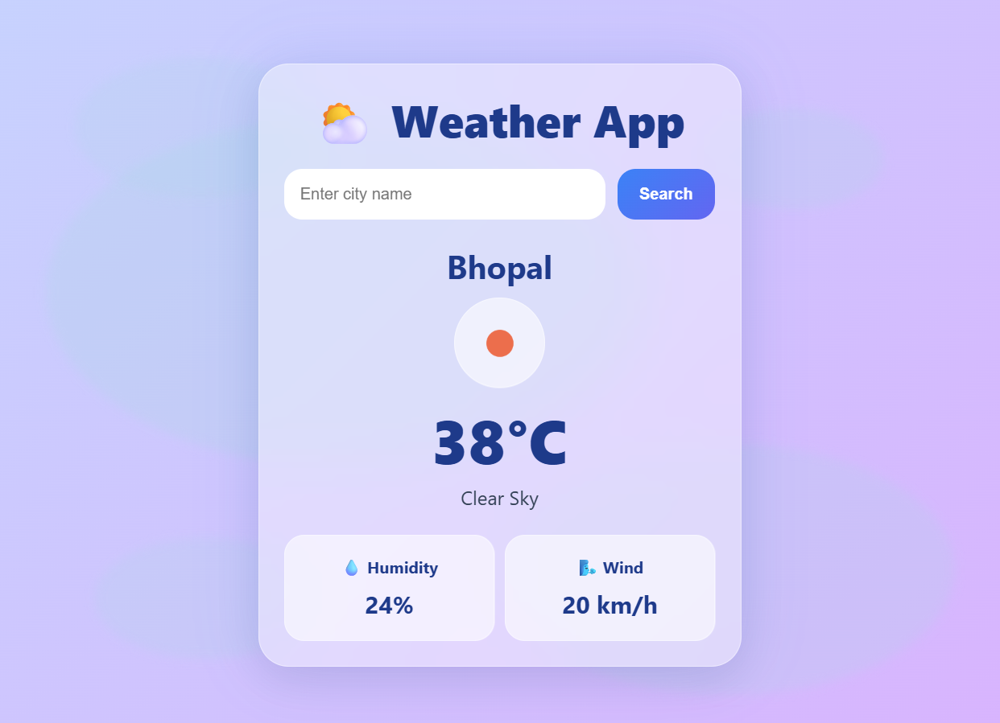
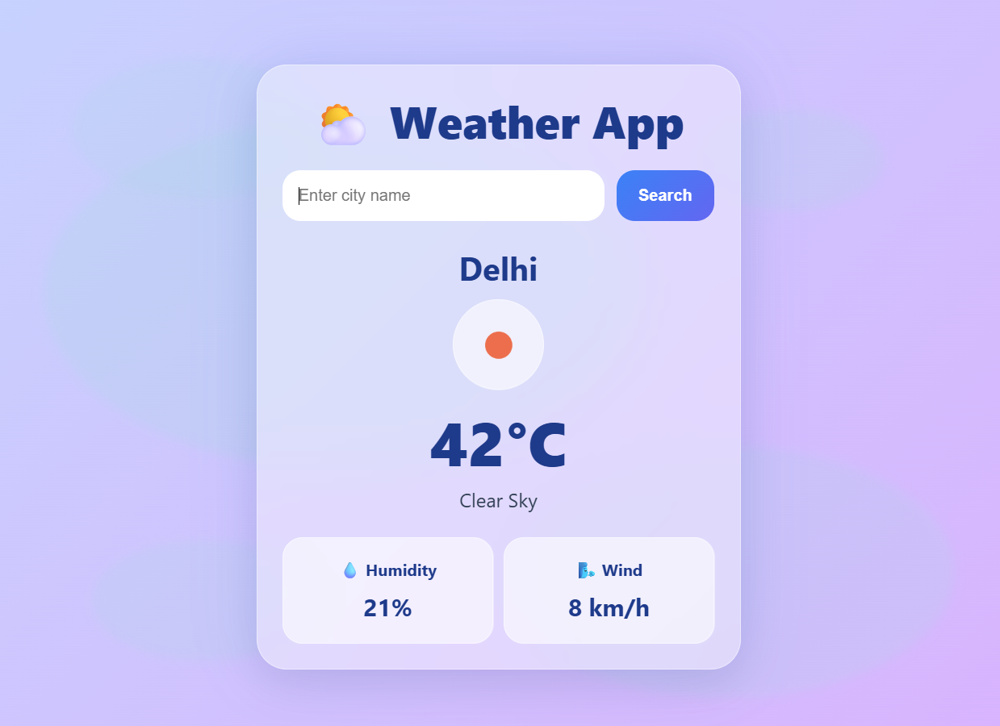
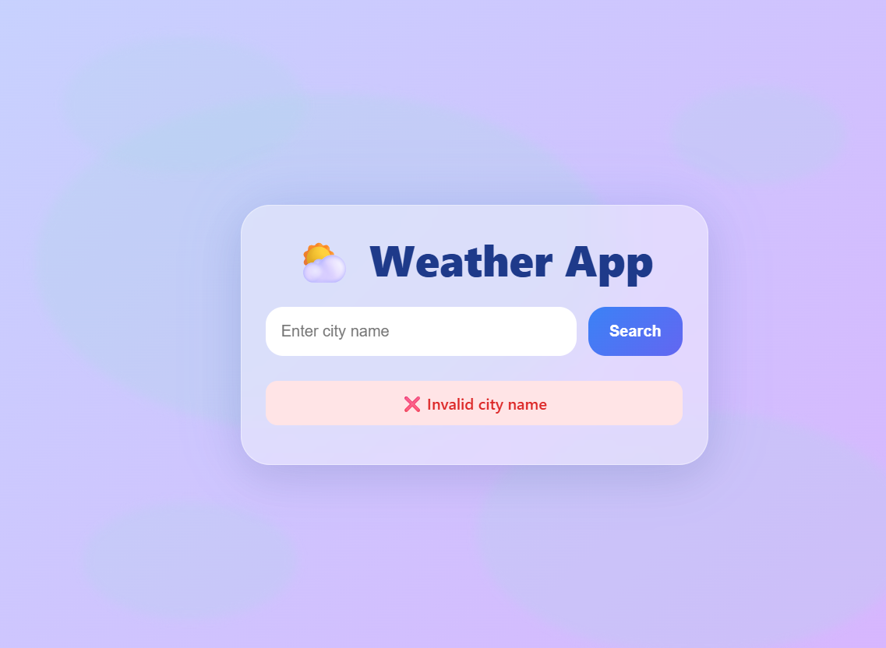
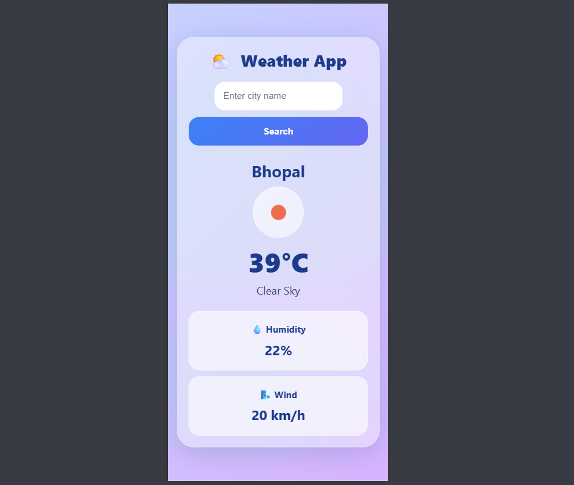

# Weather App

A responsive weather application built using HTML, CSS, and JavaScript. The application fetches real-time weather data using the OpenWeatherMap API and provides weather information for cities around the world.

## Live Demo

https://tiwarisumit95225.github.io/synent-task6-weatherapp-sumit/

## Features

* Real-time weather data
* Search weather by city name
* Temperature in Celsius
* Humidity information
* Wind speed information
* Dynamic weather icons
* Loading indicator
* Error handling for invalid city names
* Responsive design
* Mobile-friendly interface
* Enter key search support
* Default city weather on page load

## Technologies Used

* HTML5
* CSS3
* JavaScript (ES6)
* OpenWeatherMap API

## Screenshots

### Home Page



### Weather Search



### Invalid City



### Mobile View



## Project Structure

weather-app/
│
├── index.html
├── style.css
├── script.js
├── README.md
└── screenshots/

## How to Run

1. Clone the repository

```bash
git clone <https://github.com/tiwarisumit95225/synent-task6-weatherapp-sumit>
```

2. Open the project folder

3. Open index.html in your browser

## Author

Sumit Tiwari

Developed as part of the Synent Technologies Web Development Internship.
